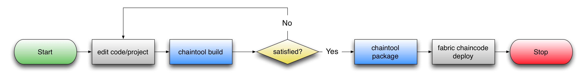

# Introduction to Chaintool - A Hyperledger Fabric Chaincode Compiler

## Summary

_chaintool_ is a utility to assist in various phases of [Hyperledger Fabric](https://github.com/hyperledger/fabric) chaincode development, such as compilation, test, packaging, and deployment.  A chaincode app developer may express the interface to their application in a highlevel interface definition language, and _chaintool_ will generate (1) chaincode stubs and (2) package the chaincode for convenient deployment.

This provides the following benefits to chaincode development:

- a language neutral description of the application interface
- a language neutral packaging of chaincode for deployment
- on the wire endian neutrality
- built-in field validation
- forwards/backwards compatiblity management
- stub function dispatch
- build/package management
- a unified query, signing, hashing, and introspection interface

## Overview

Working with _chaintool_ generally involves structuring your chaincode [project root](./application-development.md#project-structure) a specific way and then running various [subcommands](./command-reference.md).  Some commands, such as _build_, _clean_, and _package_, are used to manage general development activities.  These commands expect to be executed from within your project root by default, but may also be executed from anywhere using the "-p" switch.

Other commands such as _buildcar_, _unpack_, and _ls_ are designed to operate against a Chaincode Archive (CAR) from a previous _package_ operation.  These commands expect a path to a CAR file.

In all cases, you may obtain subcommand specific help by invoking "chaintool _$subcommand_ -h".  For example:

```
$ chaintool package -h
chaintool version: v0.10.1

Description: chaintool package - Package the chaincode into a CAR file for deployment

Usage: chaintool package [options]

Command Options:
  -o, --output NAME          path to the output destination
  -c, --compress NAME  gzip  compression algorithm to use
  -p, --path PATH      ./    path to chaincode project
  -h, --help
```

### Typical Workflow




<a rel="license" href="http://creativecommons.org/licenses/by/4.0/"></a><br />This work is licensed under a <a rel="license" href="http://creativecommons.org/licenses/by/4.0/">Creative Commons Attribution 4.0 International License</a>.
s
